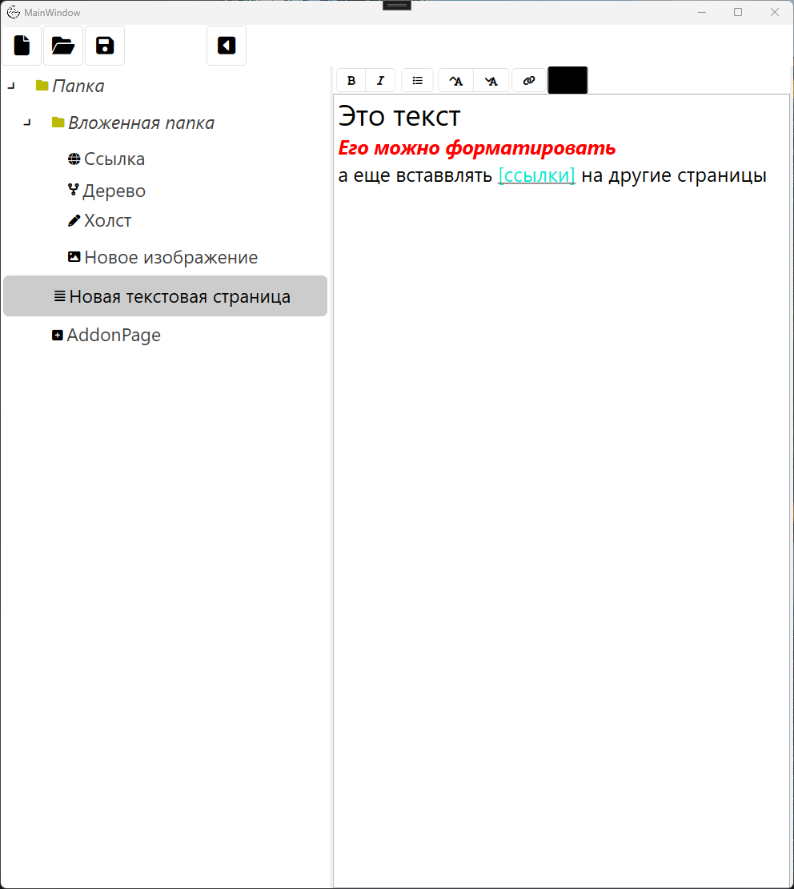
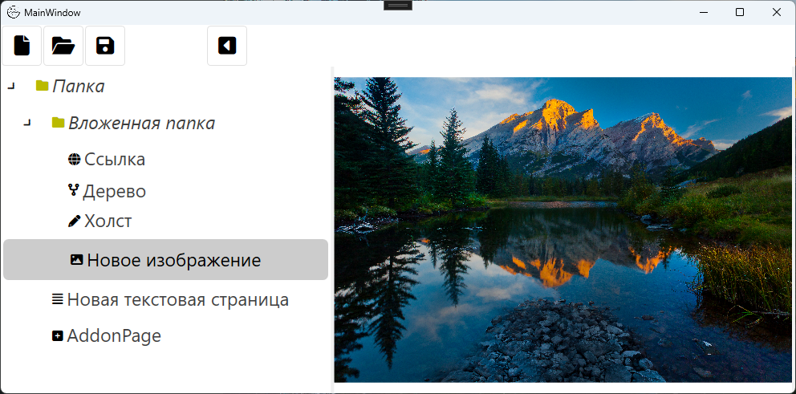
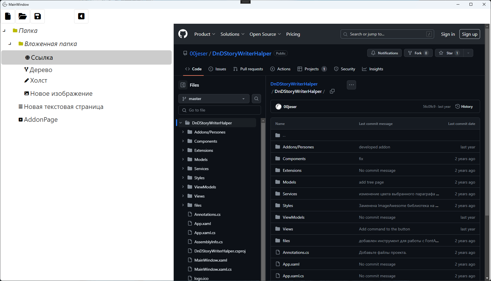
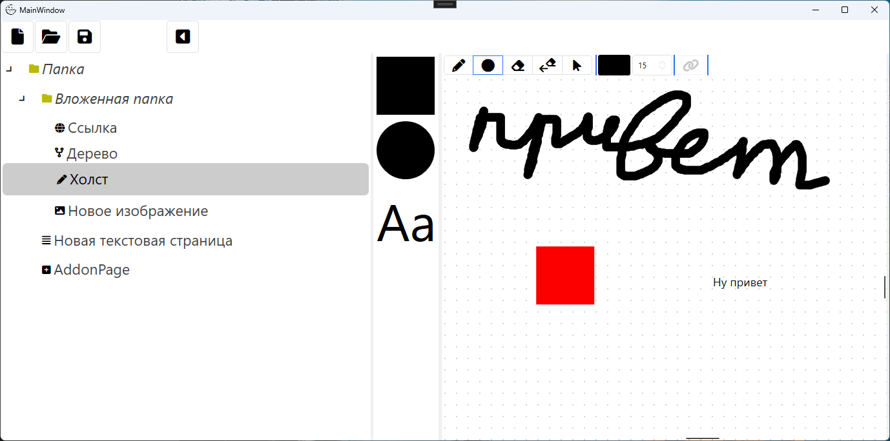
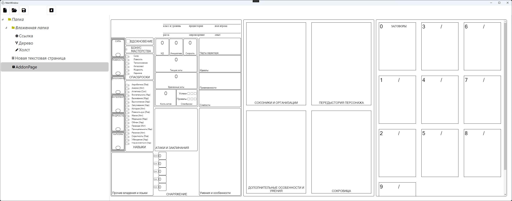

# DnDStoryWriterHalper
Это приложение для создания блакнота со страницами в разном формате
Страницы можно разделять по папкам
Существуют следующие варианты страниц
## Текстовая страница
Можно оформлять текст и делать ссылки на другие страницы 

## Страница с картинкой
Можно загрузить изображение с компьютера 

## Страница с деревом
Можно создать дерево, а каждая нода может быть ссылкой на другую страницу 

## Страница с сайтом
Можно использовать ссылку на сайт как страницу 

## Страница-доска
Можно рисовать и добавлять фигуры 

## Страница аддон
Можно написать свой вариант страницы используя html и js, пример взаимодействия страницы и приложения представлен в аддоне страницы персонажа из DnD 
